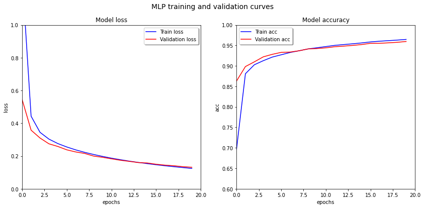

# MNIST-hand written digit database.Performing classification two different methods: MLP and CNN networks
The goal of this project recognizing handwritten digits from MNIST dataset by implementing Multilayer perceptron and Convulution Neural Network
## MLP (MultiLayer Perceptron)

  
